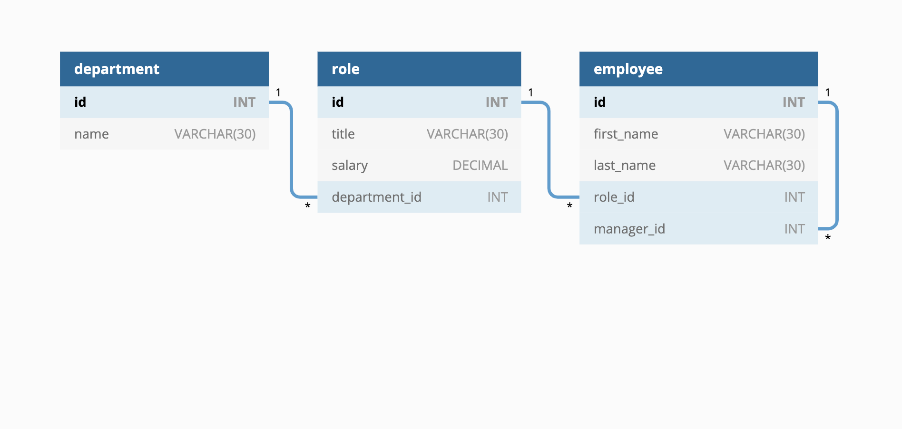
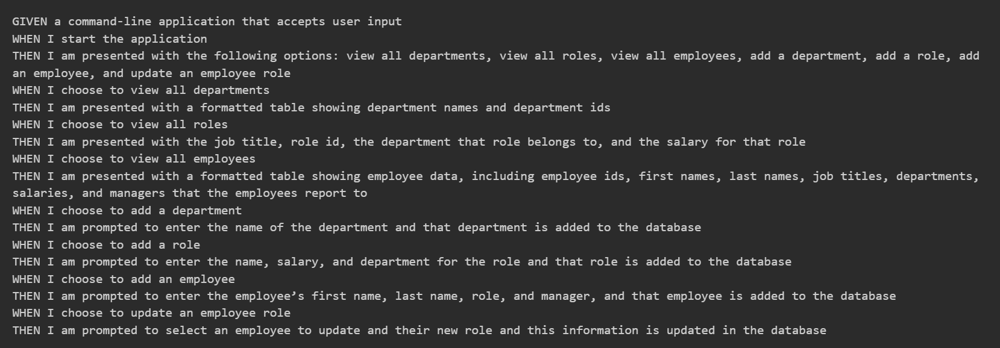

# Employee-Tracker

## Description:
In this assignment we were asked to create a command-line application to manage a company's employee database. This application uses Node.js, Inquirer, and MySQL.

We were asked to design the database schema as follows in the image:

The acceptance criteria for this assignment is as follows:

## Instalation:
The user will need to install inquirer@8.2.4 and mysql2@2.2.5.

## Usage:
https://drive.google.com/file/d/1JYfWeXMghrdpvhI3ck-jWLnmJZTk8EFZ/view

## Credits:
I had 2 tutoring sessions with Benicio Lopez. He assisted me with debugging errors in my schema.sql code and seeds.sql code. In my server.js code, Benicio assisted me with writing the code on line 20, he also assisted my with writing the code on lines 109 to 113.
AskBCS assisted me with ensuring the user is re-prompted (after making a selection) with list of options in if statement in server.js file beginning on line 37.

## License:
MIT License

